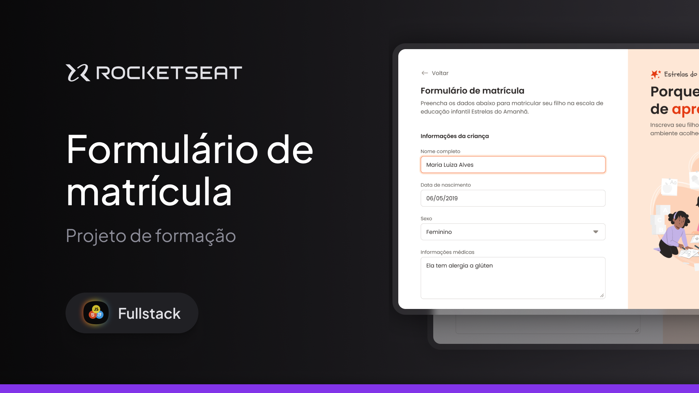

<h1 align="center">
  Formulário de matrícula
</h1>

## Projeto

O projeto é um formulário desktop para uma escola de educação infantil.

Esse é um dos projetos desenvolvidos em aula na formação Full-stack, um de nossos conteúdos de especialização.

## Tecnologias

Esse projeto foi desenvolvido com as seguintes tecnologias

- HTML
- CSS

---

## Acessar o Projeto

Para acessar o projeto, basta clicar neste link abaixo:  
<a href="https://pduartesilva2005.github.io/formulario-de-matricula/" target="_blank">Ver o projeto online!</a>

Criado por Pedro Duarte
